# CDC Consumer Correctness Harness

> Inside the [Government Systems Engineering](../../README.md) portfolio · *Cloud systems engineered for federal-grade security and compliance.*

## Overview

I built this system to prove that a CDC consumer could report the expected row count while storing stale values. A count could expose obvious duplication, but it could not establish that every key held its latest state. I therefore treated row counts as an initial signal and SHA-256 checksums as the deciding evidence for content correctness.

Before opening any implementation tool, I fixed the question, failure cases, and acceptance criteria. The harness had to generate deterministic inserts, updates, deletes, and update preimages; run two intentionally wrong consumers; and compare their outputs with a known-good target. The correct consumer also had to reject unknown change types, remove every expected preimage, remain idempotent, and use PostgreSQL 18 RETURNING OLD/NEW data for write auditing. This framing kept a plausible-looking count from being accepted as proof of correctness.

The architecture is built across **7 phases**, anchored by **The Mission: Proving That the Wrong Answer Can Look Right** on the input side and **Readout for Two Audiences: Engineering Leadership and Stakeholders** at the end. Each phase is listed in the Implementation section below.

## Architecture

```mermaid
---
title: CDC Consumer Correctness Harness
---
%%{init: {"theme":"base","themeVariables": {"primaryColor":"#1B4332","primaryTextColor":"#F4D03F","primaryBorderColor":"#F4D03F","secondaryColor":"#264653","tertiaryColor":"#2F5233","lineColor":"#F4D03F","fontFamily":"ui-monospace, SFMono-Regular, Menlo, Consolas, monospace","fontSize":"13px"}}}%%
flowchart LR
    classDef datastore fill:#264653,stroke:#F4D03F,stroke-width:2px,color:#FFFFFF
    classDef service fill:#1B4332,stroke:#F4D03F,stroke-width:2px,color:#F4D03F
    classDef event fill:#7B42BC,stroke:#F4D03F,stroke-width:2px,color:#FFFFFF
    classDef io fill:#0d1117,stroke:#F4D03F,stroke-width:1.5px,color:#F4D03F,font-style:italic

    Engineer[/Engineer owning the consumer/]
    AOs[/Two Authorizing Officials, one on each side of the boundary/]
    Leadership[/Engineering leadership reading the mechanism/]

    subgraph Framing["Fixed before any tool was opened"]
        Claim{{A consumer can report the expected row count while storing stale values}}
        CountSignal{{Row count is an initial signal, never the deciding evidence}}
        Checksum{{SHA-256 over canonical target rows decides content correctness}}
        Criteria[(Failure cases and acceptance criteria written first)]
    end

    subgraph Boundary["The interconnection, made explicit"]
        Checklist[(Interrogation checklist, a consequence beside every question)]
        Nist{{Framed under NIST SP 800-47 Rev. 1 because the feed crosses a system boundary}}
        NotCompliance{{The annex documents questions, consequences and ownership; it does not prove compliance}}
        Preimage{{"Example: are update preimages present? Processing one as current overwrites the postimage"}}
    end

    subgraph Stack["Pinned stack"]
        Postgres(PostgreSQL 18)
        Psycopg[(psycopg 3.3.4)]
        Duck[(duckdb 1.5.5)]
        Delta[(deltalake 1.6.2)]
        Repo[(GitHub for the technical record, Linear for delivery)]
        Separated{{Fixtures, consumer outputs and verification results kept in separate paths}}
    end

    subgraph Feed["The seeded change feed"]
        Generator(Deterministic generator, fixed seed)
        Events[(Inserts, updates, deletes and update preimages)]
        Expected[(Expected target state: 80 keys)]
        WhySeed{{Same events every run, so a difference is consumer behavior and not changed input}}
    end

    subgraph Wrong["Two consumers built to be wrong"]
        Append(Append consumer: every event becomes a row)
        AppendOut[(2,120 rows against an expected 80)]
        Visible{{Count exposes it immediately}}
        Upsert(Upsert consumer: one row per key, wrong order)
        UpsertOut[(Exactly 80 keys, stale values inside them)]
        Lexi{{Lexicographic sort puts update_postimage before update_preimage, so the stale value writes last}}
        Hidden{{Count reports MATCH; only the checksum fails}}
    end

    subgraph Correct["The correct consumer"]
        Filtered(Filtered consumer interpreting each change type)
        Guard1{{Guard 1: ValueError on any change type outside the supported set}}
        Guard2{{Guard 2: removed equals expected preimage count, exactly}}
        Returning(RETURNING OLD and NEW to audit every write)
        Replay(Same feed replayed to test idempotency)
        Pass[(Count and checksum both match, and hold after replay)]
    end

    subgraph Verify["Independent verification"]
        Verifier(DuckDB verifier, separate from every consumer)
        Canonical{{Canonical row representation hashed, not the record total}}
        Lesson{{Cardinality proves missing or duplicated objects; it cannot prove retained values are current}}
    end

    subgraph Real["Shape check against a real feed"]
        Cdf(Delta-rs Change Data Feed generated once)
        Columns[("_change_type, _commit_version, _commit_timestamp confirmed")]
        Vocab[(Underscore values confirmed: insert, update_preimage, update_postimage)]
        Narrow{{Confirms the interface shape only; says nothing about retention, concurrency, scale or ordering}}
    end

    subgraph Readout["Two layers, deliberately kept apart"]
        Structural[(Structural claims: what the consumer design necessarily does)]
        Regression[(Regression results: what this dated fixture measured)]
        Costly{{The costly case: every key present, values wrong, a count-only control passed}}
        Release(CI checks added, documentation completed, version tagged)
    end

    Engineer -- "commits to" --> Claim
    Claim -- "demotes" --> CountSignal
    Claim -- "elevates" --> Checksum
    Claim -- "fixed in" --> Criteria
    Engineer -- "writes" --> Checklist
    Checklist -- "framed under" --> Nist
    Nist -- "bounded by" --> NotCompliance
    Checklist -- "reads like" --> Preimage
    Checklist -- "reviewed by" --> AOs
    Engineer -- "pins" --> Postgres
    Postgres -- "reached through" --> Psycopg
    Engineer -- "pins" --> Duck
    Engineer -- "pins" --> Delta
    Engineer -- "records into" --> Repo
    Repo -- "enforces" --> Separated
    Criteria -- "specifies" --> Generator
    Generator -- "emits" --> Events
    Generator -- "also emits" --> Expected
    Generator -- "is deterministic because of" --> WhySeed
    Events -- "fed to" --> Append
    Events -- "fed to" --> Upsert
    Events -- "fed to" --> Filtered
    Append -- "produced" --> AppendOut
    AppendOut -- "against Expected shows" --> Visible
    Upsert -- "produced" --> UpsertOut
    Upsert -- "fails because" --> Lexi
    UpsertOut -- "against Expected shows" --> Hidden
    Filtered -- "protected by" --> Guard1
    Filtered -- "protected by" --> Guard2
    Filtered -- "writes through" --> Returning
    Returning -- "lands in" --> Postgres
    Filtered -- "tested again by" --> Replay
    Replay -- "returned" --> Pass
    AppendOut -- "measured by" --> Verifier
    UpsertOut -- "measured by" --> Verifier
    Pass -- "measured by" --> Verifier
    Duck -- "runs" --> Verifier
    Expected -- "is the reference for" --> Verifier
    Verifier -- "hashes via" --> Canonical
    Canonical -- "is why Hidden is caught, giving" --> Lesson
    Hidden -- "is the case that teaches" --> Lesson
    Delta -- "generates" --> Cdf
    Cdf -- "exposed" --> Columns
    Cdf -- "exposed" --> Vocab
    Columns -- "matched the fixture, bounded by" --> Narrow
    Vocab -- "matched the fixture, bounded by" --> Narrow
    Lexi -- "is a" --> Structural
    AppendOut -- "is a" --> Regression
    UpsertOut -- "is a" --> Regression
    Hidden -- "is named as" --> Costly
    Structural -- "read by" --> Leadership
    Regression -- "read by" --> Leadership
    Costly -- "shown to" --> AOs
    Pass -- "sealed with Narrow into" --> Release
    Release -- "joins inputs, evidence and limits under one tag for" --> Leadership

    class Criteria,Checklist,Psycopg,Duck,Delta,Repo,Events,Expected,AppendOut,UpsertOut,Pass,Columns,Vocab,Structural,Regression datastore
    class Postgres,Generator,Append,Upsert,Filtered,Returning,Replay,Verifier,Cdf,Release service
    class Claim,CountSignal,Checksum,Nist,NotCompliance,Preimage,Separated,WhySeed,Visible,Lexi,Hidden,Guard1,Guard2,Canonical,Lesson,Narrow,Costly event
    class Engineer,AOs,Leadership io
```

The diagram shows the topology and data flow of the system as built. The full architectural narrative, with screenshots and prose, lives in [`documents/cdc-consumer-correctness-harness.md`](./documents/cdc-consumer-correctness-harness.md).

## Implementation

This system is built across **7 phases**:

1. **The Mission: Proving That the Wrong Answer Can Look Right**
2. **Setting Up the Stack and Delivery Pipeline**
3. **Design Artifacts and the Seeded Change Feed Generator**
4. **Running Two Wrong Consumers and Measuring the Damage**
5. **Building the Correct Consumer and Proving Correctness by Checksum**
6. **Validating Against a Real Change Data Feed and Shipping the Release**
7. **Readout for Two Audiences: Engineering Leadership and Stakeholders**

For the full walkthrough with screenshots and step-by-step content, see [`documents/cdc-consumer-correctness-harness.md`](./documents/cdc-consumer-correctness-harness.md).

## Validation

Each build phase below is documented in [`documents/cdc-consumer-correctness-harness.md`](./documents/cdc-consumer-correctness-harness.md), with screenshots, configuration, and notes as captured during the build:

- ✅ The Mission: Proving That the Wrong Answer Can Look Right
- ✅ Setting Up the Stack and Delivery Pipeline
- ✅ Design Artifacts and the Seeded Change Feed Generator
- ✅ Running Two Wrong Consumers and Measuring the Damage
- ✅ Building the Correct Consumer and Proving Correctness by Checksum
- ✅ Validating Against a Real Change Data Feed and Shipping the Release
- ✅ Readout for Two Audiences: Engineering Leadership and Stakeholders
