# The Enclave That Could Not Connect

> Inside the [Government Systems Engineering](../../README.md) portfolio · *Cloud systems engineered for federal-grade security and compliance.*

## Overview

I built the simulated enclave to model a SECRET-level mission environment while using OSCAL to structure its compliance and governance evidence. The goal was to show that a classified network is defined not only by deployed resources, but by whether its boundaries and controls can be demonstrated to an authorizing official.

The connection was therefore part of the system itself. Until the enclave could prove which traffic was allowed, which paths were closed, and which controls applied at each boundary, it was not ready to connect to mission services.

I also injected a cross-domain finding on purpose. The finding tested whether the architecture and policy gates could detect an unsafe route, stop the approval path, and return the enclave to zero scanner violations after remediation.

The architecture is built across **6 phases**, anchored by **Committing to the Build** on the input side and **Briefing the Mock Authorizing Official** at the end. Each phase is listed in the Implementation section below.

## Architecture

```mermaid
---
title: Closed Enclave Connection Authorization
---
%%{init: {"theme":"base","themeVariables": {"primaryColor":"#1B4332","primaryTextColor":"#F4D03F","primaryBorderColor":"#F4D03F","secondaryColor":"#264653","tertiaryColor":"#2F5233","lineColor":"#F4D03F","fontFamily":"ui-monospace, SFMono-Regular, Menlo, Consolas, monospace","fontSize":"13px"}}}%%
flowchart LR
    classDef datastore fill:#264653,stroke:#F4D03F,stroke-width:2px,color:#FFFFFF
    classDef service fill:#1B4332,stroke:#F4D03F,stroke-width:2px,color:#F4D03F
    classDef event fill:#7B42BC,stroke:#F4D03F,stroke-width:2px,color:#FFFFFF
    classDef io fill:#0d1117,stroke:#F4D03F,stroke-width:1.5px,color:#F4D03F,font-style:italic

    Engineer[/Enclave engineer/]

    subgraph Categorize["Categorize and tailor"]
        OscalCatalog[(NIST SP 800-53 Rev 5 OSCAL catalog)]
        Cnssi1253(CNSSI 1253 Rev 5 profile tailoring)
        FipsProfile{{FIPS 140-3 crypto, sc-13_prm_1}}
        ADRs[(Architecture Decision Records)]
    end

    subgraph Boundaries["Three separate boundaries"]
        MissionBoundary(Mission Authorization Boundary, SSP)
        ConnBoundary(Network Connection Boundary)
        ProviderBoundary(Provider Inheritance Boundary, AWS IaaS)
    end

    subgraph Baseline["Closed network baseline, Terraform"]
        EnclaveVPC(Enclave VPC, no IGW or NAT)
        TGW(Transit Gateway route tables)
        InspectionVPC(Inspection VPC, Network Firewall)
        DenyAll{{Deny-all security groups, hardened AMIs}}
    end

    subgraph Identity["Identity and encryption"]
        KMS[(FIPS 140-3 KMS encryption)]
        Spire(SPIFFE/SPIRE workload identity)
    end

    subgraph Gate["Policy-as-code gate"]
        Scanners(Four policy-as-code scanners)
        ZeroBar{{Acceptance bar: zero violations}}
    end

    subgraph Package["Connection-approval package"]
        DecisionDoc[(Decision document)]
        PortsProtocols[(Ports and protocols registration)]
        ConsentMonitor[(Consent-to-monitor statements)]
        AllowedProtocols{{TLS 1.3 :443, gRPC/TLS :8081, allow-by-exception}}
    end

    subgraph Finding["Injected cross-domain finding"]
        CrossDomainRoute{{Unauthorized route: SECRET to UNCLASS shared services}}
        Detection(Four-scanner gate detects)
        Remediation(Remove route, add blackhole, propagation off)
        Poam{{POAM-001 closed, 0 open items}}
    end

    subgraph Authorization["Authorization decision"]
        AO[/Mock Authorizing Official/]
        ConnApproval[/Connection approval decision/]
    end

    Engineer -- "categorizes before building" --> OscalCatalog
    Engineer -- "injects on purpose" --> CrossDomainRoute
    OscalCatalog -- "tailored through" --> Cnssi1253
    Cnssi1253 -- "sets parameter" --> FipsProfile
    Cnssi1253 -- "recorded in" --> ADRs
    ADRs -- "scopes mission" --> MissionBoundary
    ADRs -- "scopes connection" --> ConnBoundary
    ADRs -- "scopes inheritance" --> ProviderBoundary
    FipsProfile -- "enforced by" --> KMS
    MissionBoundary -- "implemented as" --> EnclaveVPC
    EnclaveVPC -- "isolated by" --> TGW
    TGW -- "approved paths to" --> InspectionVPC
    EnclaveVPC -- "guarded by" --> DenyAll
    ProviderBoundary -- "inherits AWS controls into" --> EnclaveVPC
    KMS -- "encrypts" --> EnclaveVPC
    Spire -- "issues workload identity to" --> EnclaveVPC
    EnclaveVPC -- "evaluated by" --> Scanners
    Scanners -- "must reach" --> ZeroBar
    ConnBoundary -- "documented in" --> DecisionDoc
    DecisionDoc -- "registers" --> PortsProtocols
    PortsProtocols -- "declares" --> AllowedProtocols
    DecisionDoc -- "requires" --> ConsentMonitor
    AllowedProtocols -- "enforced through" --> InspectionVPC
    ZeroBar -- "clears the package" --> DecisionDoc
    CrossDomainRoute -- "reopens reach past" --> TGW
    Scanners -- "flags the route" --> Detection
    Detection -- "stalls" --> ConnApproval
    Detection -- "triggers" --> Remediation
    Remediation -- "restores" --> ZeroBar
    Remediation -- "closes" --> Poam
    DecisionDoc -- "briefed to" --> AO
    Poam -- "evidence to" --> AO
    ZeroBar -- "evidence to" --> AO
    AO -- "grants" --> ConnApproval

    class OscalCatalog,ADRs,KMS,DecisionDoc,PortsProtocols,ConsentMonitor datastore
    class Cnssi1253,MissionBoundary,ConnBoundary,ProviderBoundary,EnclaveVPC,TGW,InspectionVPC,Spire,Scanners,Detection,Remediation service
    class FipsProfile,DenyAll,ZeroBar,AllowedProtocols,CrossDomainRoute,Poam event
    class Engineer,AO,ConnApproval io
```

The diagram shows the topology and data flow of the system as built. The full architectural narrative, with screenshots and prose, lives in [`documents/closed-enclave-connection-authorization.md`](./documents/closed-enclave-connection-authorization.md).

## Implementation

This system is built across **6 phases**:

1. **Committing to the Build**
2. **Categorizing the Enclave and Drawing the Boundary**
3. **Building a Closed Enclave Baseline with Zero Violations**
4. **Assembling the Connection-Approval-Equivalent Package**
5. **Injecting the Finding, Stalling the Connection, and Re-Designing the Boundary**
6. **Briefing the Mock Authorizing Official**

For the full walkthrough with screenshots and step-by-step content, see [`documents/closed-enclave-connection-authorization.md`](./documents/closed-enclave-connection-authorization.md).

## Validation

Each build phase below is documented in [`documents/closed-enclave-connection-authorization.md`](./documents/closed-enclave-connection-authorization.md), with screenshots, configuration, and notes as captured during the build:

- ✅ Committing to the Build
- ✅ Categorizing the Enclave and Drawing the Boundary
- ✅ Building a Closed Enclave Baseline with Zero Violations
- ✅ Assembling the Connection-Approval-Equivalent Package
- ✅ Injecting the Finding, Stalling the Connection, and Re-Designing the Boundary
- ✅ Briefing the Mock Authorizing Official
