# Compliance Evidence Bundle Pipeline

> Inside the [Government Systems Engineering](../../README.md) portfolio · *Cloud systems engineered for federal-grade security and compliance.*

## Overview

I built this system to package security evidence into a contract-enforced bundle that a reviewer could inspect without depending on my explanation. The bundle joined six declared evidence slots with their status, source, digest, and limitation. A reviewer could validate its structure, recompute hashes, inspect the included artifacts, and identify which evidence remained incomplete.

Reviewer independence shaped the acceptance criteria. The pipeline could not treat a generated file, successful command, or builder statement as proof by itself. Each artifact needed a declared place in the schema and a verifiable relationship with the published bundle. I also separated technical integrity from assessor judgment. The implementation could prove that files matched their recorded digests and that required slots were present. It could not decide whether an external assessor would accept those artifacts as sufficient compliance evidence.

The architecture is built across **6 phases**, anchored by **Building a Contract-Enforced Compliance Evidence Bundle** on the input side and **Acceptance Test: A Reader Answers the Control Questions Cold** at the end. Each phase is listed in the Implementation section below.

## Architecture

```mermaid
---
title: Compliance Evidence Bundle Pipeline
---
%%{init: {"theme":"base","themeVariables": {"primaryColor":"#1B4332","primaryTextColor":"#F4D03F","primaryBorderColor":"#F4D03F","secondaryColor":"#264653","tertiaryColor":"#2F5233","lineColor":"#F4D03F","fontFamily":"ui-monospace, SFMono-Regular, Menlo, Consolas, monospace","fontSize":"13px"}}}%%
flowchart LR
    classDef datastore fill:#264653,stroke:#F4D03F,stroke-width:2px,color:#FFFFFF
    classDef service fill:#1B4332,stroke:#F4D03F,stroke-width:2px,color:#F4D03F
    classDef event fill:#7B42BC,stroke:#F4D03F,stroke-width:2px,color:#FFFFFF
    classDef io fill:#0d1117,stroke:#F4D03F,stroke-width:1.5px,color:#F4D03F,font-style:italic

    Builder[/Builder assembling the evidence/]
    Reviewer[/Reviewer who must not depend on the builder's explanation/]
    Assessor[/External assessor whose acceptance stays a separate judgment/]

    subgraph Contract["The contract, committed before any artifact"]
        Schema[(Six-slot JSON schema: sbom, vuln-scan, build-env, provenance, hardening-check, control-map)]
        Questions[(Control questions drawn from NIST SP 800-53 Rev. 5)]
        External{{An external catalog the builder does not control, so the bar is not self-set}}
        OrderProof{{Git history shows the contract preceded the bundle}}
        OrderLimit{{Evidence of sequence, not proof: commits and dates can be rewritten}}
    end

    subgraph Toolchain["Toolchain verified before assembly"]
        Syft(Syft, software bill of materials)
        Grype(Grype, vulnerability scan of that inventory)
        Cosign(cosign, signing and provenance material)
        Seaweed(SeaweedFS, local S3-compatible object store)
        Preflight{{Every command checked present so a missing tool fails at setup, not mid-bundle}}
    end

    subgraph Assembly["One build run, four artifacts"]
        Run(Single execution context)
        Sbom[(sbom: READY)]
        Vuln[(vuln-scan: READY)]
        BuildEnv[(build-env: READY)]
        Prov[(provenance: READY)]
        SameRun{{All four from the same run, never unrelated scans stitched into one package}}
    end

    subgraph Stubbed["Two slots kept visible, not hidden"]
        Hardening[(hardening-check: STUBBED, OpenSCAP needs Linux and the workstation runs Windows)]
        ControlMap[(control-map: STUBBED)]
        Meaning{{STUBBED means the slot exists and the artifact was not produced this run: not failed, passed or waived}}
        WhyKeep{{Deleting them shrinks the contract; marking them READY claims evidence that does not exist}}
    end

    subgraph Publish["The publish gate"]
        Validator(Contract validator over all six slots)
        Digest[(Bundle SHA-256 becomes its content identity)]
        Published[(Third run: PUBLISHED, sha256 0215a0fe...)]
    end

    subgraph Negative["Refusal proven, not assumed"]
        Missing(Test 1: required file removed, slot still named in the manifest)
        Damaged(Test 2: schema and digest expectations broken)
        Predicted{{Outcome written before each run; an unrelated crash would not count}}
        Refused[(Gate stopped before upload, named the failed requirement, minted no key)]
        Restore(Original files restored, publish rerun)
        WhyRestore{{The successful third run is what separates a contract refusal from a broken publisher}}
    end

    subgraph Store["Content-addressed storage"]
        FailedStarts[(Four earlier SeaweedFS starts failed: one panic, three with no healthy endpoint)]
        Healthy[(weed mini stayed up, endpoint returned HTTP 200)]
        Second(Second bundle published with different content)
        TwoKeys[(Two distinct SHA-256 keys in the store)]
        Retriever(Retriever: download by digest, recompute, compare)
        OlderWins{{Retrieving the older key after the workspace was overwritten is the stronger claim}}
        StoreLimit{{Proves nothing about replication, retention, or deletion by an administrator}}
    end

    subgraph Acceptance["The cold-read test, reported as compromised"]
        ColdRead(Reader answers the control questions from the bundle alone)
        TooClose{{The reader had opened the assembler's own files, so this is not independent review}}
        NotSubmission{{The bundle is an input to a submission, never the submission}}
        Stronger{{A stronger test needs a reader who did not build it and a Linux CI run for hardening}}
    end

    Builder -- "commits first" --> Schema
    Builder -- "commits first" --> Questions
    Questions -- "anchored to" --> External
    Schema -- "sequence recorded as" --> OrderProof
    OrderProof -- "bounded by" --> OrderLimit
    Builder -- "installs" --> Syft
    Builder -- "installs" --> Grype
    Builder -- "installs" --> Cosign
    Builder -- "installs" --> Seaweed
    Syft -- "checked under" --> Preflight
    Seaweed -- "checked under" --> Preflight
    Builder -- "executes" --> Run
    Syft -- "produces in" --> Sbom
    Grype -- "produces in" --> Vuln
    Run -- "captures" --> BuildEnv
    Cosign -- "produces in" --> Prov
    Run -- "binds all four under" --> SameRun
    Schema -- "requires" --> Hardening
    Schema -- "requires" --> ControlMap
    Hardening -- "carries" --> Meaning
    Meaning -- "is retained because" --> WhyKeep
    Sbom -- "validated by" --> Validator
    Hardening -- "validated by" --> Validator
    Schema -- "enforced by" --> Validator
    Validator -- "passing, computes" --> Digest
    Digest -- "third run printed" --> Published
    Builder -- "runs" --> Missing
    Builder -- "runs" --> Damaged
    Missing -- "held to" --> Predicted
    Damaged -- "held to" --> Predicted
    Missing -- "produced" --> Refused
    Damaged -- "produced" --> Refused
    Refused -- "followed by" --> Restore
    Restore -- "yields" --> Published
    Restore -- "matters because of" --> WhyRestore
    Seaweed -- "took several attempts, recorded as" --> FailedStarts
    FailedStarts -- "then" --> Healthy
    Published -- "stored on" --> Healthy
    Builder -- "then publishes" --> Second
    Second -- "alongside the first bundle gives" --> TwoKeys
    TwoKeys -- "read back through" --> Retriever
    Retriever -- "asked for the first key, which is" --> OlderWins
    OlderWins -- "bounded by" --> StoreLimit
    Questions -- "put to a reader in" --> ColdRead
    Published -- "is the only input to" --> ColdRead
    ColdRead -- "reported as" --> TooClose
    TooClose -- "sits beside" --> NotSubmission
    TooClose -- "points to" --> Stronger
    Published -- "inspectable and recomputable by" --> Reviewer
    Retriever -- "gives independent verification to" --> Reviewer
    NotSubmission -- "leaves the determination with" --> Assessor
    Reviewer -- "hands the package, limits included, to" --> Assessor

    class Schema,Questions,Sbom,Vuln,BuildEnv,Prov,Hardening,ControlMap,Digest,Published,Refused,FailedStarts,Healthy,TwoKeys datastore
    class Syft,Grype,Cosign,Seaweed,Run,Validator,Missing,Damaged,Restore,Second,Retriever,ColdRead service
    class External,OrderProof,OrderLimit,Preflight,SameRun,Meaning,WhyKeep,Predicted,WhyRestore,OlderWins,StoreLimit,TooClose,NotSubmission,Stronger event
    class Builder,Reviewer,Assessor io
```

The diagram shows the topology and data flow of the system as built. The full architectural narrative, with screenshots and prose, lives in [`documents/compliance-evidence-bundle.md`](./documents/compliance-evidence-bundle.md).

## Implementation

This system is built across **6 phases**:

1. **Building a Contract-Enforced Compliance Evidence Bundle**
2. **Writing the Contract Before the Artifacts**
3. **Assembling and Publishing the Bundle**
4. **Proving the Publish Gate Refuses**
5. **Content-Addressed Storage and Digest Verification**
6. **Acceptance Test: A Reader Answers the Control Questions Cold**

For the full walkthrough with screenshots and step-by-step content, see [`documents/compliance-evidence-bundle.md`](./documents/compliance-evidence-bundle.md).

## Validation

Each build phase below is documented in [`documents/compliance-evidence-bundle.md`](./documents/compliance-evidence-bundle.md), with screenshots, configuration, and notes as captured during the build:

- ✅ Building a Contract-Enforced Compliance Evidence Bundle
- ✅ Writing the Contract Before the Artifacts
- ✅ Assembling and Publishing the Bundle
- ✅ Proving the Publish Gate Refuses
- ✅ Content-Addressed Storage and Digest Verification
- ✅ Acceptance Test: A Reader Answers the Control Questions Cold
