# Container Hardening Compliance Pipeline

> Inside the [Government Systems Engineering](../../README.md) portfolio · *Cloud systems engineered for federal-grade security and compliance.*

## Overview

I built a dual-gate CI pipeline that hardened container images and tested them with OpenSCAP and Trivy. The system replaced the broad question "Is this secure?" with machine-checked assertions that could pass or fail against recorded criteria.

OpenSCAP measured configuration rules, while Trivy checked the image for known vulnerabilities. The pipeline treated both results as required evidence instead of allowing one successful scanner to represent the full security state.

This approach made the outcome falsifiable because a failed rule, changed count, or detected vulnerability could contradict the claim that the image met the gate. A green run still had limits. It showed that the tested image passed the selected community-maintained checks at that moment. It did not prove complete security or replace an authoritative compliance assessment.

The architecture is built across **6 phases**, anchored by **Building a Falsifiable Compliance Pipeline** on the input side and **Regression Drill and Handover Test** at the end. Each phase is listed in the Implementation section below.

## Architecture

```mermaid
---
title: Container Hardening Compliance Pipeline
---
%%{init: {"theme":"base","themeVariables": {"primaryColor":"#1B4332","primaryTextColor":"#F4D03F","primaryBorderColor":"#F4D03F","secondaryColor":"#264653","tertiaryColor":"#2F5233","lineColor":"#F4D03F","fontFamily":"ui-monospace, SFMono-Regular, Menlo, Consolas, monospace","fontSize":"13px"}}}%%
flowchart LR
    classDef datastore fill:#264653,stroke:#F4D03F,stroke-width:2px,color:#FFFFFF
    classDef service fill:#1B4332,stroke:#F4D03F,stroke-width:2px,color:#F4D03F
    classDef event fill:#7B42BC,stroke:#F4D03F,stroke-width:2px,color:#FFFFFF
    classDef io fill:#0d1117,stroke:#F4D03F,stroke-width:1.5px,color:#F4D03F,font-style:italic

    Engineer[/Engineer hardening a container image/]
    Assessor[/Assessor who needs the claim to be checkable/]
    NextOperator[/Second operator asked to repeat the drill/]

    subgraph Question["Replacing an unanswerable question"]
        Vague{{"Is this secure? cannot pass or fail"}}
        Assertions{{Machine-checked assertions against recorded criteria}}
        Falsifiable{{A failed rule or changed count can contradict the claim}}
    end

    subgraph Decisions["Four records written before the build"]
        Adr001[(ADR-001: community-maintained ComplianceAsCode profiles)]
        NotAuthoritative{{"Fidelity limit: not an assessment of record, no DISA content, no SCC scanner"}}
        Adr002[(ADR-002: both gates required)]
        Adr003[(ADR-003: weekly rebuild)]
        Adr004[(ADR-004: what vulnerability evidence counts)]
        WhyFirst{{Written first so accidental settings cannot be presented later as deliberate policy}}
    end

    subgraph Infra["Delivery structure, kept separate"]
        Repo[(Private GitHub repository)]
        Linear(Linear epics and stories)
        Wsl(WSL2 with OpenSCAP, Ansible and Trivy)
        Skeleton("Workflow skeleton committed to main before any scan logic")
        KnownStart{{Later hardening changes start from a recorded structure}}
    end

    subgraph Schedule["Recurring execution"]
        Cron[("cron 0 3 * * 1, read in UTC")]
        Weekly{{One rebuild every Monday at 03:00 UTC}}
        WhyRecur{{Packages and vulnerability data move while the repository stays still}}
        HistoryProves{{The cron sets intent, workflow history is the evidence a run completed}}
    end

    subgraph Before["The BEFORE baseline"]
        Unhardened(Unhardened Ubuntu 22.04 image with OpenSSH server)
        ScanOne("OpenSCAP baseline scan")
        Counts[(23 pass, 7 fail, 198 not applicable, 228 evaluated)]
        Denominator[(Effective denominator: 30 applicable rules)]
        WhyFixed{{A fixed denominator is what stops a smaller count meaning a smaller scope}}
    end

    subgraph Remediate["Repair driven by the baseline"]
        Playbook("Ansible playbook generated from the baseline failures")
        Targeted{{Aimed at the findings actually measured, not a generic checklist}}
        Rebuilt(Remediation applied during the container build)
    end

    subgraph After["The AFTER measurement"]
        ScanTwo("OpenSCAP rescan under the same profile")
        AfterCounts[(29 pass, 1 fail, same 30-rule set)]
        Reconciles{{"23 plus 7 equals 30 before, 29 plus 1 equals 30 after"}}
        SixMoved[(Six applicable rules moved from fail to pass)]
        Remaining{{The one remaining failure stays visible, so this is not called complete hardening}}
    end

    subgraph Gates["Two gates, neither standing in for the other"]
        Trivy("Trivy vulnerability scan")
        Openscap{{OpenSCAP answers configuration}}
        Vulns{{Trivy answers known vulnerabilities}}
        BothRequired{{A lower configuration count does not settle vulnerability status}}
        Green[(A green run: this image passed these declared controls at this moment)]
    end

    subgraph Handover["The drill that did not pass"]
        NoSecond[("No second person completed the handover test")]
        Q1{{Unanswered: how to trigger a rebuild in Actions}}
        Q2{{Unanswered: what to do when the run stays green and no failing report appears}}
        Stale[("oscap-docker returned command not found, and recovery was undocumented")]
        InHead{{Implementation knowledge sat in the builder's context, not in the runbook}}
    end

    Engineer -- "starts from" --> Vague
    Vague -- "replaced by" --> Assertions
    Assertions -- "make the outcome" --> Falsifiable
    Engineer -- "records" --> Adr001
    Adr001 -- "carries" --> NotAuthoritative
    Engineer -- "records" --> Adr002
    Engineer -- "records" --> Adr003
    Engineer -- "records" --> Adr004
    Adr001 -- "written under" --> WhyFirst
    Engineer -- "creates" --> Repo
    Engineer -- "tracks work in" --> Linear
    Engineer -- "installs" --> Wsl
    Repo -- "first receives" --> Skeleton
    Skeleton -- "gives" --> KnownStart
    Skeleton -- "registers" --> Cron
    Adr003 -- "specifies" --> Cron
    Cron -- "requests" --> Weekly
    Weekly -- "exists because of" --> WhyRecur
    Weekly -- "bounded by" --> HistoryProves
    Engineer -- "builds" --> Unhardened
    Wsl -- "supplies the scanner for" --> ScanOne
    Unhardened -- "measured by" --> ScanOne
    Adr001 -- "supplies the profile for" --> ScanOne
    ScanOne -- "reported" --> Counts
    Counts -- "228 evaluated less 198 not applicable gives" --> Denominator
    Denominator -- "held constant because" --> WhyFixed
    Counts -- "7 failures become the target of" --> Playbook
    Playbook -- "scoped by" --> Targeted
    Playbook -- "applied by" --> Rebuilt
    Rebuilt -- "measured by" --> ScanTwo
    Denominator -- "reused by" --> ScanTwo
    ScanTwo -- "reported" --> AfterCounts
    Counts -- "with AfterCounts satisfies" --> Reconciles
    Reconciles -- "isolates" --> SixMoved
    AfterCounts -- "still carries" --> Remaining
    ScanTwo -- "answers only" --> Openscap
    Rebuilt -- "also scanned by" --> Trivy
    Trivy -- "answers only" --> Vulns
    Openscap -- "with Vulns forces" --> BothRequired
    Adr002 -- "is why of" --> BothRequired
    BothRequired -- "produces" --> Green
    NotAuthoritative -- "limits what can be claimed from" --> Green
    Green -- "handed to" --> Assessor
    Falsifiable -- "is what makes it usable by" --> Assessor
    NextOperator -- "attempts the drill, producing" --> NoSecond
    NoSecond -- "recorded instead as" --> Q1
    NoSecond -- "recorded instead as" --> Q2
    NextOperator -- "hit" --> Stale
    Q1 -- "together show" --> InHead
    Stale -- "together show" --> InHead
    InHead -- "is the gap the runbook owes" --> NextOperator

    class Adr001,Adr002,Adr003,Adr004,Repo,Cron,Counts,Denominator,AfterCounts,SixMoved,Green,NoSecond,Stale datastore
    class Linear,Wsl,Skeleton,Unhardened,ScanOne,Playbook,Rebuilt,ScanTwo,Trivy service
    class Vague,Assertions,Falsifiable,NotAuthoritative,WhyFirst,KnownStart,Weekly,WhyRecur,HistoryProves,WhyFixed,Targeted,Reconciles,Remaining,Openscap,Vulns,BothRequired,Q1,Q2,InHead event
    class Engineer,Assessor,NextOperator io
```

The diagram shows the topology and data flow of the system as built. The full architectural narrative, with screenshots and prose, lives in [`documents/container-hardening-pipeline.md`](./documents/container-hardening-pipeline.md).

## Implementation

This system is built across **6 phases**:

1. **Building a Falsifiable Compliance Pipeline**
2. **Establishing the Delivery Infrastructure**
3. **Documenting Architectural Decisions**
4. **Establishing the BEFORE Baseline**
5. **Proving the Reduction with a Dual-Gate Pipeline**
6. **Regression Drill and Handover Test**

For the full walkthrough with screenshots and step-by-step content, see [`documents/container-hardening-pipeline.md`](./documents/container-hardening-pipeline.md).

## Validation

Each build phase below is documented in [`documents/container-hardening-pipeline.md`](./documents/container-hardening-pipeline.md), with screenshots, configuration, and notes as captured during the build:

- ✅ Building a Falsifiable Compliance Pipeline
- ✅ Establishing the Delivery Infrastructure
- ✅ Documenting Architectural Decisions
- ✅ Establishing the BEFORE Baseline
- ✅ Proving the Reduction with a Dual-Gate Pipeline
- ✅ Regression Drill and Handover Test
