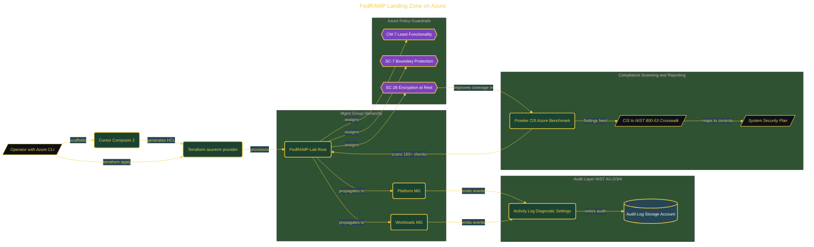

# FedRAMP Landing Zone on Azure

> Inside the [Government Systems Engineering](../../README.md) portfolio · *Cloud systems engineered for federal-grade security and compliance.*

## Overview

This project establishes a FedRAMP-ready landing zone on Azure using Terraform, Azure Policy, and Prowler.

The goal is to build a secure baseline aligned to NIST 800-53 controls, where compliance is enforced through infrastructure, not documentation.

The architecture is built across **7 phases**, anchored by **Setting Up the Compliance Toolkit** on the input side and **Wrapping Up: What Was Built and What Comes Next** at the end. Each phase is listed in the Implementation section below.

## Architecture

The diagram shows the topology and data flow of the system as built. The full architectural narrative, with screenshots and prose, lives in [`documents/fedramp-landing-zone-azure.md`](./documents/fedramp-landing-zone-azure.md).

## Implementation

This system is built across **7 phases**:

1. **Setting Up the Compliance Toolkit**
2. **Building the Azure Management Group Hierarchy**
3. **Enabling Centralized Audit Logging**
4. **Running the Prowler CIS Azure Benchmark Scan**
5. **Mapping Findings to NIST 800-53 and Drafting the SSP**
6. **Enforcing Encryption at Rest (SC-28)**
7. **Wrapping Up: What Was Built and What Comes Next**

For the full walkthrough with screenshots and step-by-step content, see [`documents/fedramp-landing-zone-azure.md`](./documents/fedramp-landing-zone-azure.md).

## Validation

Build outcomes verified end-to-end. Each phase below is captured with screenshots, configuration, and observable behavior in [`documents/fedramp-landing-zone-azure.md`](./documents/fedramp-landing-zone-azure.md):

- ✅ Setting Up the Compliance Toolkit
- ✅ Building the Azure Management Group Hierarchy
- ✅ Enabling Centralized Audit Logging
- ✅ Running the Prowler CIS Azure Benchmark Scan
- ✅ Mapping Findings to NIST 800-53 and Drafting the SSP
- ✅ Enforcing Encryption at Rest (SC-28)
- ✅ Wrapping Up: What Was Built and What Comes Next
