# GitOps Dev Zone Bootstrap with Argo CD

> Inside the [Government Systems Engineering](../../README.md) portfolio · *Cloud systems engineered for federal-grade security and compliance.*

## Overview

I built a GitOps delivery pipeline on a local Kubernetes cluster with Argo CD and Kustomize. Git stored the desired state, while Argo CD watched that source and reconciled the cluster without direct workload changes through kubectl apply.

The architecture separated application source from deployment manifests and placed an AppProject fence around the development workload. Dev used automated synchronization and self-healing, while Integration required manual approval before synchronization.

This design created a controlled path from commit to cluster. It supported versioned changes, visible drift, automatic correction in development, and slower promotion in a higher zone. I tested those claims through deployment, an attempted repository-boundary violation, manual scaling, self-healing, and a separate Integration application with an empty syncPolicy.

The architecture is built across **7 phases**, anchored by **The Mission: GitOps for a Federal Data Platform** on the input side and **Promoting to Integration and the Two-Speed Model** at the end. Each phase is listed in the Implementation section below.

## Architecture

```mermaid
---
title: GitOps Dev Zone Bootstrap with Argo CD
---
%%{init: {"theme":"base","themeVariables": {"primaryColor":"#1B4332","primaryTextColor":"#F4D03F","primaryBorderColor":"#F4D03F","secondaryColor":"#264653","tertiaryColor":"#2F5233","lineColor":"#F4D03F","fontFamily":"ui-monospace, SFMono-Regular, Menlo, Consolas, monospace","fontSize":"13px"}}}%%
flowchart LR
    classDef datastore fill:#264653,stroke:#F4D03F,stroke-width:2px,color:#FFFFFF
    classDef service fill:#1B4332,stroke:#F4D03F,stroke-width:2px,color:#F4D03F
    classDef event fill:#7B42BC,stroke:#F4D03F,stroke-width:2px,color:#FFFFFF
    classDef io fill:#0d1117,stroke:#F4D03F,stroke-width:1.5px,color:#F4D03F,font-style:italic

    Engineer[/Platform engineer changing the federal data platform/]
    Approver[/Approver holding the gate on the higher zone/]

    subgraph Repos["Two repositories, deliberately split"]
        AppSource[(Application source repository)]
        GitOpsRepo[(GitOps deployment repository, desired state only)]
        Dr002{{"DR-002: split over a monorepo, so a build cannot retrigger itself"}}
        Histories{{Code history and deployment history stay separate}}
        Dr002Reverse{{Reversal: if the platform stays single-zone with no promotion, the second repository stops earning its cost}}
    end

    subgraph Manifests["Kustomize layout inside the GitOps repository"]
        Base[(Kustomize base)]
        DevOverlay[(overlays/dev)]
        IntOverlay[(overlays/int)]
        ReplicaOne[(Base desired state: replicas 1)]
        Explicit{{Overlays keep zone differences explicit without copying the base}}
    end

    subgraph ControlPlane["Local cluster and reconciliation engine"]
        Kind(Kind local Kubernetes cluster)
        ArgoCD(Argo CD control plane)
        Watch(Repository watch and comparison loop)
    end

    subgraph Credentials["Access, narrowed after bootstrap"]
        ReadOnlyPat[(Read-only Personal Access Token)]
        WhyRead{{Read access is enough because the engine pulls state and never writes back}}
        BootstrapSecret[(argocd-initial-admin-secret, clear-text bootstrap password)]
        Rotated(Password rotated, then the bootstrap Secret deleted)
        ActiveHash[(Active password hash remains in argocd-secret)]
        FailedRead{{"argocd admin initial-password now fails: it reads only the deleted Secret"}}
        Proof{{The failure proves the credential is gone, not that access was lost}}
    end

    subgraph Fence["The AppProject permission fence"]
        Project[(platform-dev AppProject)]
        OneSource{{Least privilege on where manifests may come from}}
        OneDest{{Least privilege on where resources may be created}}
        Unreachable(Violation 1: an unreachable private repository)
        ConnFail{{Failed on connectivity, so it never reached the project check}}
        Reachable(Violation 2: a reachable public example repository)
        Refused{{Refused because the repository is not permitted in the project}}
        Separated{{Kept apart so an unreachable source is never reported as a blocked one}}
    end

    subgraph DevZone["Development zone, fast correction"]
        DevApp[(platform-dev-app, automated sync)]
        CreateNs{{CreateNamespace true, so the destination is made through the controlled path}}
        NsDev[(Namespace dev)]
        SvcNginx[(Service nginx)]
        DeployNginx[(Deployment nginx)]
        NeverApplied{{No kubectl apply against dev for the workload, only for the Argo CD custom resources}}
    end

    subgraph Drill["The drift drill, run twice"]
        ScaleThree(Manual scale to 3, self-heal off)
        Detected[(OutOfSync reported, still 3 of 3 after 30 seconds)]
        EnableHeal(Self-heal enabled on the application)
        ScaleFive(Manual scale to 5, self-heal on)
        Restored[(Back to 1 of 1 in about 6 seconds, Synced and Healthy)]
        TwoThings{{Detection and correction are separate capabilities}}
    end

    subgraph IntZone["Integration zone, approval first"]
        IntApp[(platform-int-app, empty syncPolicy)]
        Reports{{Argo CD reports drift but will not create or reverse anything}}
        ManualSync(Synchronization waits for an explicit sync command)
        Dr004{{DR-004: the two-speed model, automatic below, approved above}}
    end

    Engineer -- "commits code to" --> AppSource
    Engineer -- "commits desired state to" --> GitOpsRepo
    AppSource -- "kept apart from the deployment path by" --> Dr002
    GitOpsRepo -- "chosen by" --> Dr002
    Dr002 -- "preserves" --> Histories
    Dr002 -- "bounded by" --> Dr002Reverse
    GitOpsRepo -- "contains" --> Base
    Base -- "specialised by" --> DevOverlay
    Base -- "specialised by" --> IntOverlay
    Base -- "declares" --> ReplicaOne
    DevOverlay -- "together with the base gives" --> Explicit
    Kind -- "hosts" --> ArgoCD
    ArgoCD -- "runs" --> Watch
    ReadOnlyPat -- "grants the engine access to" --> GitOpsRepo
    ReadOnlyPat -- "scoped by" --> WhyRead
    ArgoCD -- "ships with" --> BootstrapSecret
    BootstrapSecret -- "superseded by" --> Rotated
    Rotated -- "leaves" --> ActiveHash
    Rotated -- "produces" --> FailedRead
    FailedRead -- "read correctly as" --> Proof
    ArgoCD -- "authorized by" --> Project
    Project -- "restricts source via" --> OneSource
    Project -- "restricts destination via" --> OneDest
    Engineer -- "attempts" --> Unreachable
    Unreachable -- "stopped by" --> ConnFail
    Engineer -- "then attempts" --> Reachable
    Reachable -- "stopped by" --> Refused
    OneSource -- "is what actually produced" --> Refused
    ConnFail -- "distinguished from Refused by" --> Separated
    Watch -- "reads" --> DevOverlay
    Watch -- "drives" --> DevApp
    DevApp -- "permitted by" --> Project
    DevApp -- "configured with" --> CreateNs
    DevApp -- "creates" --> NsDev
    DevApp -- "creates" --> SvcNginx
    DevApp -- "creates" --> DeployNginx
    DeployNginx -- "created under" --> NeverApplied
    Engineer -- "runs" --> ScaleThree
    ScaleThree -- "against DeployNginx produced" --> Detected
    Detected -- "showed detection without correction, so the engineer ran" --> EnableHeal
    EnableHeal -- "applied to" --> DevApp
    Engineer -- "then runs" --> ScaleFive
    ScaleFive -- "corrected to" --> Restored
    ReplicaOne -- "is the value restored in" --> Restored
    Detected -- "with Restored proves" --> TwoThings
    Watch -- "reads" --> IntOverlay
    Watch -- "drives" --> IntApp
    IntApp -- "behaves under" --> Reports
    IntApp -- "waits for" --> ManualSync
    Approver -- "issues" --> ManualSync
    TwoThings -- "is what makes the split policy meaningful in" --> Dr004
    DevApp -- "fast side of" --> Dr004
    IntApp -- "slow side of" --> Dr004

    class AppSource,GitOpsRepo,Base,DevOverlay,IntOverlay,ReplicaOne,ReadOnlyPat,BootstrapSecret,ActiveHash,Project,DevApp,NsDev,SvcNginx,DeployNginx,Detected,Restored,IntApp datastore
    class Kind,ArgoCD,Watch,Rotated,Unreachable,Reachable,ScaleThree,EnableHeal,ScaleFive,ManualSync service
    class Dr002,Histories,Dr002Reverse,Explicit,WhyRead,FailedRead,Proof,OneSource,OneDest,ConnFail,Refused,Separated,CreateNs,NeverApplied,TwoThings,Reports,Dr004 event
    class Engineer,Approver io
```

The diagram shows the topology and data flow of the system as built. The full architectural narrative, with screenshots and prose, lives in [`documents/gitops-dev-zone-bootstrap.md`](./documents/gitops-dev-zone-bootstrap.md).

## Implementation

This system is built across **7 phases**:

1. **The Mission: GitOps for a Federal Data Platform**
2. **Standing Up the Cluster and Reconciliation Engine**
3. **Building the Deployment Repository**
4. **Connecting the Repository and Fencing the Application**
5. **Deploying Through the GitOps Path**
6. **Running the Drift Drill: Self-Heal Proven**
7. **Promoting to Integration and the Two-Speed Model**

For the full walkthrough with screenshots and step-by-step content, see [`documents/gitops-dev-zone-bootstrap.md`](./documents/gitops-dev-zone-bootstrap.md).

## Validation

Each build phase below is documented in [`documents/gitops-dev-zone-bootstrap.md`](./documents/gitops-dev-zone-bootstrap.md), with screenshots, configuration, and notes as captured during the build:

- ✅ The Mission: GitOps for a Federal Data Platform
- ✅ Standing Up the Cluster and Reconciliation Engine
- ✅ Building the Deployment Repository
- ✅ Connecting the Repository and Fencing the Application
- ✅ Deploying Through the GitOps Path
- ✅ Running the Drift Drill: Self-Heal Proven
- ✅ Promoting to Integration and the Two-Speed Model
