# Govern DORA Metrics with DevLake

> Inside the [Government Systems Engineering](../../README.md) portfolio · *Cloud systems engineered for federal-grade security and compliance.*

## Overview

I built this measurement system to give a federal delivery leader defensible evidence about software delivery performance across a GitLab deployment pipeline. The decision was not simply whether a metric looked good or bad. It was whether the measured results were trustworthy enough to influence funding, operational priorities, and future delivery controls.

I defined five governed measures: Deployment Frequency, Change Lead Time, Change Failure Rate, Failed Deployment Recovery Time, and Rework Rate. Each measure needed a named source, declared calculation, known limitation, and reversal condition. This prevented the dashboard from presenting numbers without explaining how they were produced. I treated the dashboard as a decision surface backed by a governance contract, not as an independent source of truth. Any funding or performance conclusion still depended on complete GitLab deployment evidence and separately collected incident records.

The architecture is built across **7 phases**, anchored by **Framing the Federal Delivery Decision** on the input side and **Red-Teaming a Measurement Decision** at the end. Each phase is listed in the Implementation section below.

## Architecture

```mermaid
---
title: Govern DORA Metrics with DevLake
---
%%{init: {"theme":"base","themeVariables": {"primaryColor":"#1B4332","primaryTextColor":"#F4D03F","primaryBorderColor":"#F4D03F","secondaryColor":"#264653","tertiaryColor":"#2F5233","lineColor":"#F4D03F","fontFamily":"ui-monospace, SFMono-Regular, Menlo, Consolas, monospace","fontSize":"13px"}}}%%
flowchart LR
    classDef datastore fill:#264653,stroke:#F4D03F,stroke-width:2px,color:#FFFFFF
    classDef service fill:#1B4332,stroke:#F4D03F,stroke-width:2px,color:#F4D03F
    classDef event fill:#7B42BC,stroke:#F4D03F,stroke-width:2px,color:#FFFFFF
    classDef io fill:#0d1117,stroke:#F4D03F,stroke-width:1.5px,color:#F4D03F,font-style:italic

    Leader[/Federal delivery leader deciding funding and priorities/]
    Reviewer[/Independent reviewer asked to challenge one decision/]

    subgraph Decision["The decision, framed first"]
        Question{{Not whether a number looks good, but whether it is trustworthy enough to move funding}}
        Surface{{The dashboard is a decision surface backed by a contract, never a source of truth}}
    end

    subgraph Contract["Governance pack, written before any panel"]
        FiveMeasures[(Deployment Frequency, Change Lead Time, Change Failure Rate, Failed Deployment Recovery Time, Rework Rate)]
        PerMeasure{{Each names its sources, calculation boundary, limits, validation method and decision use}}
        Adrs[(Four decision records: source selection, incident ingestion, rework classification, governance)]
        Triggers{{Every record carries a reversal trigger}}
        Separation{{A definition is separate from its displayed value, so a panel can change without the metric silently changing}}
    end

    subgraph Workbench["Local measurement workbench"]
        DevLake(Apache DevLake, collection and transformation)
        Grafana(Grafana, source-labelled panels)
        Compose[(Docker Compose stack with supporting databases)]
        Secret[(128-character ENCRYPTION_SECRET from the OS random generator, git-ignored, never in chat or screenshots)]
        NotProd{{Reproducible, not production: no availability, resilience or scale claim}}
    end

    subgraph Delivery["Delivery evidence, native to GitLab"]
        GitLab(GitLab CE 19.3.1, private project)
        Seeded[(Seeded commits, merge requests and four production deployments)]
        Frequency[(Deployment Frequency and Change Lead Time populate)]
        Empty[(Stability panels stay empty)]
        Boundary{{Read as a data-boundary finding, never as a zero failure rate}}
    end

    subgraph Incidents["Incident evidence, deliberately separate"]
        Webhook(Incoming Webhook, INCIDENT records)
        Linked[(Project-scoped incident-to-deployment relationships)]
        Stability[(Change Failure Rate and Recovery Time populate)]
        WhySeparate{{A successful deployment record cannot be mistaken for proof of operational success}}
        Dependency{{If the webhook stops, the dashboard reads better than reality}}
    end

    subgraph Control["Assertion 3, the negative control"]
        Before[(Original failure rate recorded)]
        Detach(Webhook detached, Collect Data rerun, four deployments untouched)
        Broken[(Relationship table empty, Change Failure Rate reads 0 percent)]
        Restore(Webhook reattached, collected again)
        After[(Original rate returns)]
        Causality{{Before, broken and restored readings prove the missing source caused the false gain}}
        Response{{Governance response: monitor source completeness, reject an unqualified zero}}
    end

    subgraph Release["Evidence 1.0, a GitHub release"]
        Package[(Decision records, validation requirements, source labels, negative-control evidence)]
        Frozen{{A reviewable baseline, not a claim that future values hold}}
        Panels[(Every panel names its measure, definition and source path)]
    end

    subgraph RedTeam["The challenge, tracked in Linear and reported as open"]
        Ticket(Linear review request carrying the release, decisions and a live dashboard view)
        NoResult[(No reviewer result recorded at readout)]
        NotDone{{Assignment and access do not prove a neutral review happened}}
        Trigger(ADR-003 trigger checked: a native incident connector with equal fidelity)
        Accept[(Trigger did not fire, verdict stays Accept)]
        Additive{{A challenge can accept or reverse, never erase the original record}}
    end

    Leader -- "poses" --> Question
    Question -- "answered under" --> Surface
    Question -- "specified as" --> FiveMeasures
    FiveMeasures -- "each governed by" --> PerMeasure
    FiveMeasures -- "decided through" --> Adrs
    Adrs -- "carry" --> Triggers
    PerMeasure -- "establishes" --> Separation
    Compose -- "runs" --> DevLake
    Compose -- "runs" --> Grafana
    Secret -- "protects stored credentials inside" --> DevLake
    Compose -- "bounded by" --> NotProd
    GitLab -- "holds" --> Seeded
    Seeded -- "collected by" --> DevLake
    DevLake -- "fills" --> Frequency
    DevLake -- "leaves" --> Empty
    Empty -- "interpreted as" --> Boundary
    Boundary -- "names the next required source" --> Webhook
    Webhook -- "ingested by" --> DevLake
    DevLake -- "builds" --> Linked
    Linked -- "fills" --> Stability
    Webhook -- "kept apart from the delivery source because" --> WhySeparate
    Linked -- "introduces" --> Dependency
    Stability -- "captured as" --> Before
    Dependency -- "tested by" --> Detach
    Detach -- "produced" --> Broken
    Broken -- "followed by" --> Restore
    Restore -- "produced" --> After
    Before -- "with the broken and restored readings proves" --> Causality
    Causality -- "drives" --> Response
    Frequency -- "rendered by" --> Grafana
    Stability -- "rendered by" --> Grafana
    Grafana -- "publishes" --> Panels
    Panels -- "released with" --> Package
    Causality -- "included in" --> Package
    Adrs -- "included in" --> Package
    Package -- "read as" --> Frozen
    Package -- "handed to" --> Reviewer
    Reviewer -- "receives" --> Ticket
    Ticket -- "at readout showed" --> NoResult
    NoResult -- "reported under" --> NotDone
    Triggers -- "one of which is checked by" --> Trigger
    Trigger -- "returned" --> Accept
    Accept -- "recorded under" --> Additive
    Panels -- "presented with the contract to" --> Leader
    Response -- "is what keeps a favourable panel honest for" --> Leader

    class FiveMeasures,Adrs,Compose,Secret,Seeded,Frequency,Empty,Linked,Stability,Before,Broken,After,Package,Panels,NoResult,Accept datastore
    class DevLake,Grafana,GitLab,Webhook,Detach,Restore,Ticket,Trigger service
    class Question,Surface,PerMeasure,Triggers,Separation,NotProd,Boundary,WhySeparate,Dependency,Causality,Response,Frozen,NotDone,Additive event
    class Leader,Reviewer io
```

The diagram shows the topology and data flow of the system as built. The full architectural narrative, with screenshots and prose, lives in [`documents/governed-dora-delivery-measures.md`](./documents/governed-dora-delivery-measures.md).

## Implementation

This system is built across **7 phases**:

1. **Framing the Federal Delivery Decision**
2. **Building the Measurement Workbench**
3. **Defining Defensible Measurement Governance**
4. **Establishing Native GitLab Delivery Evidence**
5. **Connecting Incident Evidence to Deployment Outcomes**
6. **Publishing a Governed Five-Measure Delivery Dashboard**
7. **Red-Teaming a Measurement Decision**

For the full walkthrough with screenshots and step-by-step content, see [`documents/governed-dora-delivery-measures.md`](./documents/governed-dora-delivery-measures.md).

## Validation

Each build phase below is documented in [`documents/governed-dora-delivery-measures.md`](./documents/governed-dora-delivery-measures.md), with screenshots, configuration, and notes as captured during the build:

- ✅ Framing the Federal Delivery Decision
- ✅ Building the Measurement Workbench
- ✅ Defining Defensible Measurement Governance
- ✅ Establishing Native GitLab Delivery Evidence
- ✅ Connecting Incident Evidence to Deployment Outcomes
- ✅ Publishing a Governed Five-Measure Delivery Dashboard
- ✅ Red-Teaming a Measurement Decision
