# Simulate a JWCC Multi-Cloud Authorization

> Inside the [Government Systems Engineering](../../README.md) portfolio · *Cloud systems engineered for federal-grade security and compliance.*

## Overview

This project onboards a DoD logistics data pipeline onto a JWCC-equivalent multi-cloud architecture. The goal was to show that the workload could be deployed across AWS, Azure, Google Cloud, and OCI while keeping a clear RMF/FISMA authorization boundary.

The system tested more than cloud portability. It had to prove that provider failover, control inheritance, policy checks, encryption, networking, monitoring, and evidence generation could stay aligned across different cloud environments.

This mattered because a workload can run in more than one cloud and still fail authorization if the boundary, inherited controls, and evidence package are not rebuilt correctly. The build made that distinction explicit.

The architecture is built across **7 phases**, anchored by **Mission Overview: JWCC Multi-Cloud Authorization Simulation** on the input side and **Secret Mission: Provider Failover Against RPO and RTO** at the end. Each phase is listed in the Implementation section below.

## Architecture

```mermaid
---
title: Simulate a JWCC Multi-Cloud Authorization
---
%%{init: {"theme":"base","themeVariables": {"primaryColor":"#1B4332","primaryTextColor":"#F4D03F","primaryBorderColor":"#F4D03F","secondaryColor":"#264653","tertiaryColor":"#2F5233","lineColor":"#F4D03F","fontFamily":"ui-monospace, SFMono-Regular, Menlo, Consolas, monospace","fontSize":"13px"}}}%%
flowchart LR
    classDef datastore fill:#264653,stroke:#F4D03F,stroke-width:2px,color:#FFFFFF
    classDef service fill:#1B4332,stroke:#F4D03F,stroke-width:2px,color:#F4D03F
    classDef event fill:#7B42BC,stroke:#F4D03F,stroke-width:2px,color:#FFFFFF
    classDef io fill:#0d1117,stroke:#F4D03F,stroke-width:1.5px,color:#F4D03F,font-style:italic

    subgraph Swarm["44-Agent Swarm (Cursor Composer)"]
        Composer(["Cursor Composer orchestrator"])
        Cursorrules[(".cursorrules + project roster")]
        BoundaryFirst[/"boundary-first method"/]
    end

    subgraph Boundary["Authorization Boundary (RMF/FISMA)"]
        AuthBoundary[/"RMF/FISMA authorization boundary"/]
        RPO[/"RPO target: 15 min"/]
        RTO[/"RTO target: 30 min"/]
    end

    subgraph Baseline["Cloud-Agnostic Baseline (Terraform)"]
        TFInterface(["cloud-agnostic Terraform interface"])
        AWSMod(["AWS module"])
        AzureMod(["Azure module"])
        GCPMod(["GCP module"])
        OCIMod(["OCI module"])
    end

    subgraph CAP["CAP-Equivalent Network Boundary"]
        CentralEgress{{"centralized inspection egress"}}
        AWSNFW(["AWS Network Firewall"])
        AzureFW(["Azure Firewall Premium"])
        GCPIDS(["GCP Cloud IDS + packet mirroring"])
        OCIDRG(["OCI DRG + Network Firewall"])
        FIPS[/"FIPS-validated crypto"/]
    end

    subgraph Policy["Policy-as-Code Gates"]
        Conftest{{"Conftest"}}
        Checkov{{"Checkov"}}
        SC7[/"sc7_boundary + sc7_egress: SC-7"/]
        SC8[/"sc8_transmission: SC-8"/]
        SC28[/"sc28_encryption: SC-28"/]
    end

    subgraph Capability["Capability Router"]
        ParityMatrix[("parity-matrix.yaml")]
        DataClassGap[/"data_classification gap (CUI)"/]
        Macie(["AWS Macie"])
        Purview(["Azure Purview"])
        GCPDLP(["GCP DLP API (custom)"])
        OCINone[/"OCI: no managed service"/]
        Fallback{{"router fallback: AWS then Azure, OCI excluded"}}
    end

    subgraph Controls["IL5 Control Tailoring (800-53 Rev 5)"]
        Inherited[/"inherited: CSP FedRAMP High PA"/]
        SystemOwned[/"system-owned: repo Terraform + Rego"/]
        Shared[/"shared: provider plus mission"/]
    end

    subgraph Oscal["OSCAL Evidence (compliance-trestle)"]
        SSP[("jwcc-simulation-ssp.json")]
        ComponentDef[("component-definition.json")]
        Poam[("poam.json")]
        TrestleValidate{{"trestle validate -a"}}
    end

    subgraph Bars["Four Validation Bars"]
        BoundaryBar[/"boundary bar"/]
        CoverageBar[/"control coverage bar"/]
        CryptoBar[/"crypto bar"/]
        PortabilityBar[/"portability bar"/]
    end

    subgraph Package["ATO-Style Authorization Package"]
        MarpSlides[/"Marp authorization briefing"/]
        Dashboard[/"interactive compliance dashboard"/]
        BoundaryDiagram[/"system-security-boundary.svg"/]
        MockAO[/"mock Authorizing Official"/]
        FiveCaveats[/"five load-bearing caveats"/]
    end

    subgraph Failover["Secret Mission: Failover vs RPO and RTO"]
        FailoverProof[("failover-proof.md")]
        MeasuredRTO[/"measured RTO: 4.67 min"/]
        AzureFailover(["Azure failover plan"])
        Reinherit[/"re-inherit 107 controls"/]
        AOReview{{"boundary redraw returns to AO"}}
    end

    Composer -- "governs" --> Cursorrules
    Cursorrules -- "assigns roles under" --> BoundaryFirst
    BoundaryFirst -- "works from" --> AuthBoundary
    RPO -- "caps replication lag" --> AzureFailover
    RTO -- "bounds" --> CentralEgress
    AuthBoundary -- "scopes" --> TFInterface

    TFInterface -- "renders" --> AWSMod
    TFInterface -- "renders" --> AzureMod
    TFInterface -- "renders" --> GCPMod
    TFInterface -- "renders" --> OCIMod

    AWSMod -- "routes egress through" --> CentralEgress
    AzureMod -- "routes egress through" --> CentralEgress
    GCPMod -- "routes egress through" --> CentralEgress
    OCIMod -- "routes egress through" --> CentralEgress
    CentralEgress -- "inspects via" --> AWSNFW
    CentralEgress -- "inspects via" --> AzureFW
    CentralEgress -- "inspects via" --> GCPIDS
    CentralEgress -- "inspects via" --> OCIDRG
    CentralEgress -- "encrypts under" --> FIPS

    Conftest -- "blocks 0.0.0.0/0 to IGW" --> CentralEgress
    Conftest -- "evaluates" --> SC7
    Conftest -- "evaluates" --> SC8
    Checkov -- "evaluates" --> SC28
    SC7 -- "enforced by" --> CentralEgress
    SC28 -- "enforced by" --> FIPS

    ParityMatrix -- "declares" --> DataClassGap
    DataClassGap -- "AWS path" --> Macie
    DataClassGap -- "Azure path" --> Purview
    DataClassGap -- "GCP path" --> GCPDLP
    DataClassGap -- "no path" --> OCINone
    ParityMatrix -- "drives" --> Fallback
    Fallback -- "places on" --> Macie
    Fallback -- "excludes" --> OCINone

    Inherited -- "cites" --> SSP
    SystemOwned -- "documented in" --> ComponentDef
    Shared -- "splits SC-28 with" --> FIPS
    SSP -- "validated by" --> TrestleValidate
    ComponentDef -- "validated by" --> TrestleValidate
    Poam -- "tracks gaps for" --> TrestleValidate

    AuthBoundary -- "evidenced by" --> BoundaryBar
    TrestleValidate -- "proves" --> CoverageBar
    FIPS -- "proves" --> CryptoBar
    Fallback -- "proves" --> PortabilityBar

    BoundaryBar -- "assembled into" --> Package
    CoverageBar -- "assembled into" --> Package
    CryptoBar -- "assembled into" --> Package
    PortabilityBar -- "assembled into" --> Package
    MarpSlides -- "briefs" --> MockAO
    Dashboard -- "shows status to" --> MockAO
    BoundaryDiagram -- "supports" --> MockAO
    FiveCaveats -- "preserve AO authority for" --> MockAO

    AzureFailover -- "recorded in" --> FailoverProof
    FailoverProof -- "measures" --> MeasuredRTO
    MeasuredRTO -- "under 30 min target" --> RTO
    AzureFailover -- "triggers" --> Reinherit
    Reinherit -- "forces" --> AOReview
    AOReview -- "returns to" --> MockAO

    class Cursorrules,ParityMatrix,SSP,ComponentDef,Poam,FailoverProof datastore
    class Composer,TFInterface,AWSMod,AzureMod,GCPMod,OCIMod,AWSNFW,AzureFW,GCPIDS,OCIDRG,Macie,Purview,GCPDLP,AzureFailover service
    class CentralEgress,Conftest,Checkov,Fallback,TrestleValidate,AOReview event
    class BoundaryFirst,AuthBoundary,RPO,RTO,FIPS,SC7,SC8,SC28,DataClassGap,OCINone,Inherited,SystemOwned,Shared,BoundaryBar,CoverageBar,CryptoBar,PortabilityBar,MarpSlides,Dashboard,BoundaryDiagram,MockAO,FiveCaveats,MeasuredRTO,Reinherit io
```

The diagram shows the topology and data flow of the system as built. The full architectural narrative, with screenshots and prose, lives in [`documents/jwcc-multi-cloud-authorization.md`](./documents/jwcc-multi-cloud-authorization.md).

## Implementation

This system is built across **7 phases**:

1. **Mission Overview: JWCC Multi-Cloud Authorization Simulation**
2. **Defining the Authorization Boundary and Agent Swarm**
3. **Building the Cloud-Agnostic Baseline Across Four Providers**
4. **Surfacing the Capability Gap and Proving Portability**
5. **Tailoring the IL5-Equivalent Control Set and Structuring OSCAL Evidence**
6. **Delivering the ATO-Style Authorization Package**
7. **Secret Mission: Provider Failover Against RPO and RTO**

For the full walkthrough with screenshots and step-by-step content, see [`documents/jwcc-multi-cloud-authorization.md`](./documents/jwcc-multi-cloud-authorization.md).

## Validation

Each build phase below is documented in [`documents/jwcc-multi-cloud-authorization.md`](./documents/jwcc-multi-cloud-authorization.md), with screenshots, configuration, and notes as captured during the build:

- ✅ Mission Overview: JWCC Multi-Cloud Authorization Simulation
- ✅ Defining the Authorization Boundary and Agent Swarm
- ✅ Building the Cloud-Agnostic Baseline Across Four Providers
- ✅ Surfacing the Capability Gap and Proving Portability
- ✅ Tailoring the IL5-Equivalent Control Set and Structuring OSCAL Evidence
- ✅ Delivering the ATO-Style Authorization Package
- ✅ Secret Mission: Provider Failover Against RPO and RTO
