# Multi-Cloud GovRAMP Modernization Lab

> Inside the [Government Systems Engineering](../../README.md) portfolio · *Cloud systems engineered for federal-grade security and compliance.*

## Overview

The environment setup establishes the execution layer for all subsequent steps.

WSL2 provides a Linux-compatible runtime for consistent tooling behavior. Cursor IDE acts as the development interface for authoring infrastructure and documentation, while CLI tools enable direct interaction with cloud providers and Kubernetes clusters. Authentication is configured across AWS, Azure, and GCP, and billing alerts are set to prevent uncontrolled cost growth during experimentation. This step ensures that all tools operate within a unified and repeatable environment.

The architecture is built across **9 phases**, anchored by **The Mission: Modernizing State Government Infrastructure** on the input side and **Wrapping Up: Teardown and Cost Verification** at the end. Each phase is listed in the Implementation section below.

## Architecture

```mermaid
---
title: Multi-Cloud GovRAMP Modernization Lab
---
%%{init: {"theme":"base","themeVariables": {"primaryColor":"#1B4332","primaryTextColor":"#F4D03F","primaryBorderColor":"#F4D03F","secondaryColor":"#264653","tertiaryColor":"#2F5233","lineColor":"#F4D03F","fontFamily":"ui-monospace, SFMono-Regular, Menlo, Consolas, monospace","fontSize":"13px"}}}%%
flowchart LR
    classDef datastore fill:#264653,stroke:#F4D03F,stroke-width:2px,color:#FFFFFF
    classDef service fill:#1B4332,stroke:#F4D03F,stroke-width:2px,color:#F4D03F
    classDef event fill:#7B42BC,stroke:#F4D03F,stroke-width:2px,color:#FFFFFF
    classDef io fill:#0d1117,stroke:#F4D03F,stroke-width:1.5px,color:#F4D03F,font-style:italic


    subgraph LocalDev["Local Dev Layer"]
        WSL2[/"WSL2 + Cursor IDE"/]
        CLI[/"AWS / Azure / GCP CLIs"/]
    end

    subgraph IaCControl["IaC + GitOps Control"]
        OpenTofu("OpenTofu Multi-Provider")
        ArgoCD("Argo CD Hub")
        AppOfApps{{"App-of-Apps Sync"}}
    end

    subgraph MultiCloud["Multi-Cloud Boundary"]
        AWS("AWS k3s Cluster")
        Azure("Azure k3s Cluster")
        GCP("GCP k3s Cluster")
        OnPrem("On-Prem k3s Hub")
    end

    subgraph DRLayer["COOP / DR Layer"]
        Velero("Velero Backup Agent")
        BackupBucket[("Shared Backup Bucket")]
        DRDrill{{"Cross-Cluster DR Drill"}}
    end

    subgraph Governance["GovRAMP Evidence"]
        Crosswalk[("60-Control Crosswalk")]
        CostGuard{{"Billing Alerts + Cost Caps"}}
        ATOReview[/"ATO Readiness Report"/]
    end

    WSL2 -- "authors IaC" --> OpenTofu
    CLI -- "auth + scoped access" --> OpenTofu
    OpenTofu -- "provisions clusters" --> AWS
    OpenTofu -- "provisions clusters" --> Azure
    OpenTofu -- "provisions clusters" --> GCP
    OpenTofu -- "provisions clusters" --> OnPrem
    ArgoCD -- "registers remote kubeconfigs" --> AWS
    ArgoCD -- "registers remote kubeconfigs" --> Azure
    ArgoCD -- "registers remote kubeconfigs" --> GCP
    OnPrem -- "hosts" --> ArgoCD
    AppOfApps -- "declares desired state" --> ArgoCD
    Velero -- "snapshots workloads" --> BackupBucket
    BackupBucket -- "restores to alt cluster" --> DRDrill
    AWS -- "backed up by" --> Velero
    Azure -- "backed up by" --> Velero
    GCP -- "backed up by" --> Velero
    CostGuard -- "guards spend" --> OpenTofu
    Crosswalk -- "maps artifacts to controls" --> ATOReview
    DRDrill -- "RTO / RPO evidence" --> Crosswalk
    class BackupBucket,Crosswalk datastore
    class OpenTofu,ArgoCD,AWS,Azure,GCP,OnPrem,Velero service
    class AppOfApps,DRDrill,CostGuard event
    class WSL2,CLI,ATOReview io
```

The diagram shows the topology and data flow of the system as built. The full architectural narrative, with screenshots and prose, lives in [`documents/multi-cloud-govramp-lab.md`](./documents/multi-cloud-govramp-lab.md).

## Implementation

This system is built across **9 phases**:

1. **The Mission: Modernizing State Government Infrastructure**
2. **Building the Lab Environment**
3. **Provisioning the Multi-Cloud System Boundary with OpenTofu**
4. **Deploying GitOps Control with Argo CD**
5. **Implementing COOP Disaster Recovery with Velero**
6. **Authoring the GovRAMP Crosswalk and Migration Wave Plan**
7. **Quality Review and ATO Readiness Assessment**
8. **Crossplane vs. OpenTofu Portability Comparison**
9. **Wrapping Up: Teardown and Cost Verification**

For the full walkthrough with screenshots and step-by-step content, see [`documents/multi-cloud-govramp-lab.md`](./documents/multi-cloud-govramp-lab.md).

## Validation

Build outcomes verified end-to-end. Each phase below is captured with screenshots, configuration, and observable behavior in [`documents/multi-cloud-govramp-lab.md`](./documents/multi-cloud-govramp-lab.md):

- ✅ The Mission: Modernizing State Government Infrastructure
- ✅ Building the Lab Environment
- ✅ Provisioning the Multi-Cloud System Boundary with OpenTofu
- ✅ Deploying GitOps Control with Argo CD
- ✅ Implementing COOP Disaster Recovery with Velero
- ✅ Authoring the GovRAMP Crosswalk and Migration Wave Plan
- ✅ Quality Review and ATO Readiness Assessment
- ✅ Crossplane vs. OpenTofu Portability Comparison
- ✅ Wrapping Up: Teardown and Cost Verification
