# Multi-Cloud GovRAMP Modernization Lab

> Inside the [Government Systems Engineering](../../README.md) portfolio · *Cloud systems engineered for federal-grade security and compliance.*

## Overview

A reproducible state-government modernization lab that provisions a four-cluster Kubernetes platform across AWS, Azure, GCP, and on-prem, then governs it the way a public-sector authorization package expects: explicit system boundary, GitOps-controlled configuration baseline, and a Velero-backed continuity-of-operations (COOP) plan. The work is shaped around the GovRAMP framework and the federal expectation that scope, controls, and evidence are defined before workloads are deployed.

OpenTofu provisions each cloud independently with provider-scoped modules so the four-cluster boundary is loosely coupled but unified through a single kubeconfig. Argo CD runs from the on-prem hub as the control plane, enforcing an App-of-Apps deployment pattern that makes every change to the benefits portal traceable through Git history. Velero performs scheduled backups and validated cross-cluster restores, producing the kind of operational evidence a state authorizing official needs to sign an ATO.

The architecture below shows the system boundary: OpenTofu modules → four k3s clusters (AWS / Azure / GCP / on-prem hub) → Argo CD GitOps from hub → Velero backup-and-restore → GovRAMP control crosswalk → ATO-ready evidence package.

## Architecture

```mermaid
---
title: Multi-Cloud GovRAMP Modernization Lab
---
%%{init: {"theme":"base","themeVariables": {"primaryColor":"#1B4332","primaryTextColor":"#F4D03F","primaryBorderColor":"#F4D03F","secondaryColor":"#264653","tertiaryColor":"#2F5233","lineColor":"#F4D03F","fontFamily":"ui-monospace, SFMono-Regular, Menlo, Consolas, monospace","fontSize":"13px"}}}%%
flowchart LR
    classDef datastore fill:#264653,stroke:#F4D03F,stroke-width:2px,color:#FFFFFF
    classDef service fill:#1B4332,stroke:#F4D03F,stroke-width:2px,color:#F4D03F
    classDef event fill:#7B42BC,stroke:#F4D03F,stroke-width:2px,color:#FFFFFF
    classDef io fill:#0d1117,stroke:#F4D03F,stroke-width:1.5px,color:#F4D03F,font-style:italic


    subgraph LocalDev["Local Dev Layer"]
        WSL2[/"WSL2 + Cursor IDE"/]
        CLI[/"AWS / Azure / GCP CLIs"/]
    end

    subgraph IaCControl["IaC + GitOps Control"]
        OpenTofu("OpenTofu Multi-Provider")
        ArgoCD("Argo CD Hub")
        AppOfApps{{"App-of-Apps Sync"}}
    end

    subgraph MultiCloud["Multi-Cloud Boundary"]
        AWS("AWS k3s Cluster")
        Azure("Azure k3s Cluster")
        GCP("GCP k3s Cluster")
        OnPrem("On-Prem k3s Hub")
    end

    subgraph DRLayer["COOP / DR Layer"]
        Velero("Velero Backup Agent")
        BackupBucket[("Shared Backup Bucket")]
        DRDrill{{"Cross-Cluster DR Drill"}}
    end

    subgraph Governance["GovRAMP Evidence"]
        Crosswalk[("60-Control Crosswalk")]
        CostGuard{{"Billing Alerts + Cost Caps"}}
        ATOReview[/"ATO Readiness Report"/]
    end

    WSL2 -- "authors IaC" --> OpenTofu
    CLI -- "auth + scoped access" --> OpenTofu
    OpenTofu -- "provisions clusters" --> AWS
    OpenTofu -- "provisions clusters" --> Azure
    OpenTofu -- "provisions clusters" --> GCP
    OpenTofu -- "provisions clusters" --> OnPrem
    ArgoCD -- "registers remote kubeconfigs" --> AWS
    ArgoCD -- "registers remote kubeconfigs" --> Azure
    ArgoCD -- "registers remote kubeconfigs" --> GCP
    OnPrem -- "hosts" --> ArgoCD
    AppOfApps -- "declares desired state" --> ArgoCD
    Velero -- "snapshots workloads" --> BackupBucket
    BackupBucket -- "restores to alt cluster" --> DRDrill
    AWS -- "backed up by" --> Velero
    Azure -- "backed up by" --> Velero
    GCP -- "backed up by" --> Velero
    CostGuard -- "guards spend" --> OpenTofu
    Crosswalk -- "maps artifacts to controls" --> ATOReview
    DRDrill -- "RTO / RPO evidence" --> Crosswalk
    class BackupBucket,Crosswalk datastore
    class OpenTofu,ArgoCD,AWS,Azure,GCP,OnPrem,Velero service
    class AppOfApps,DRDrill,CostGuard event
    class WSL2,CLI,ATOReview io
```

The diagram shows the topology and data flow of the system as built. The full architectural narrative, with screenshots and prose, lives in [`documents/multi-cloud-govramp-lab.md`](./documents/multi-cloud-govramp-lab.md).

## Implementation

This system is built across **9 phases**:

1. **The Mission: Modernizing State Government Infrastructure**
2. **Building the Lab Environment**
3. **Provisioning the Multi-Cloud System Boundary with OpenTofu**
4. **Deploying GitOps Control with Argo CD**
5. **Implementing COOP Disaster Recovery with Velero**
6. **Authoring the GovRAMP Crosswalk and Migration Wave Plan**
7. **Quality Review and ATO Readiness Assessment**
8. **Crossplane vs. OpenTofu Portability Comparison**
9. **Wrapping Up: Teardown and Cost Verification**

For the full walkthrough with screenshots and step-by-step content, see [`documents/multi-cloud-govramp-lab.md`](./documents/multi-cloud-govramp-lab.md).

## Validation

Each build phase below is documented in [`documents/multi-cloud-govramp-lab.md`](./documents/multi-cloud-govramp-lab.md), with screenshots, configuration, and notes as captured during the build:

- ✅ The Mission: Modernizing State Government Infrastructure
- ✅ Building the Lab Environment
- ✅ Provisioning the Multi-Cloud System Boundary with OpenTofu
- ✅ Deploying GitOps Control with Argo CD
- ✅ Implementing COOP Disaster Recovery with Velero
- ✅ Authoring the GovRAMP Crosswalk and Migration Wave Plan
- ✅ Quality Review and ATO Readiness Assessment
- ✅ Crossplane vs. OpenTofu Portability Comparison
- ✅ Wrapping Up: Teardown and Cost Verification
