# Zero-Cost Federal Platform Rehearsal Rig

> Inside the [Government Systems Engineering](../../README.md) portfolio · *Cloud systems engineered for federal-grade security and compliance.*

## Overview

I built a zero-cost federal platform rehearsal rig to test whether the planned delivery path could work before funding. The rig runs a three-zone promotion flow, object storage, database migrations, and pipeline stages in a local Kubernetes environment. It provides evidence that the components can connect and that the delivery sequence can be rehearsed.

The rig must never be treated as proof of production readiness. It does not reproduce federal cloud accounts, managed services, security boundaries, operational staffing, or provisioning delays. Its purpose is narrower: expose design problems early, verify the pipeline shape, and create a working reference for future funding decisions. The fidelity map records where the local build matches the intended platform and where it does not.

The architecture is built across **7 phases**, anchored by **The Mission: A Zero-Cost Federal Rehearsal Rig** on the input side and **End-to-End Promotion Pipeline Through GitLab Stages** at the end. Each phase is listed in the Implementation section below.

## Architecture

```mermaid
---
title: Zero-Cost Federal Platform Rehearsal Rig
---
%%{init: {"theme":"base","themeVariables": {"primaryColor":"#1B4332","primaryTextColor":"#F4D03F","primaryBorderColor":"#F4D03F","secondaryColor":"#264653","tertiaryColor":"#2F5233","lineColor":"#F4D03F","fontFamily":"ui-monospace, SFMono-Regular, Menlo, Consolas, monospace","fontSize":"13px"}}}%%
flowchart LR
    classDef datastore fill:#264653,stroke:#F4D03F,stroke-width:2px,color:#FFFFFF
    classDef service fill:#1B4332,stroke:#F4D03F,stroke-width:2px,color:#F4D03F
    classDef event fill:#7B42BC,stroke:#F4D03F,stroke-width:2px,color:#FFFFFF
    classDef io fill:#0d1117,stroke:#F4D03F,stroke-width:1.5px,color:#F4D03F,font-style:italic

    Engineer[/Platform engineer rehearsing before funding/]
    ProgramOffice[/Program office deciding whether to fund/]
    Successor[/Successor receiving the handoff/]

    subgraph Design["Design before deployment"]
        ADRs[(Architecture Decision Records)]
        Adr001[(ADR-001: kind v0.32.0, three namespaces, one cluster)]
        Tradeoff{{Trade-off: namespaces give promotion shape, not zone isolation}}
        Reversal{{Reversal trigger: admission policy must be tested per zone}}
        Branches(Branch-based workflow: design, build, test, docs)
    end

    subgraph Cluster["Local kind cluster"]
        Kind(kind v0.32.0 control plane)
        Dev[(dev namespace)]
        Int[(int namespace)]
        Prod[(prod namespace)]
        Kustomize(Kustomize overlays per zone)
    end

    subgraph Storage["Object store and arrival path"]
        Seaweed(SeaweedFS: master, volume, filer, S3)
        Bucket[(buckets/test-bucket)]
        FilerEvent{{Create event on the filer metadata stream, oldEntry null}}
        S3Gap{{S3 notification API unavailable for the required behavior}}
    end

    subgraph Data["Database change control"]
        Postgres[(PostgreSQL 18, version-fixed)]
        MigrationUser(migration_user: schema changes only)
        AppUser(app_user: runtime reads and writes)
        LeastPriv{{Split keeps migration authority out of the traffic path}}
    end

    subgraph Pipeline["Promotion pipeline"]
        GitLab(GitLab CE)
        Runner(GitLab runner container)
        RunnerNet{{Runner network path to the cluster API, the hardest defect}}
        Stages(Stages apply dev, then int, then prod)
        Ready{{Filer, master, S3, volume at 1/1 Ready in all three zones}}
    end

    subgraph Governance["Governance that travels with the rig"]
        FidelityMap[(Fidelity Map: six critical gaps)]
        Owners{{Each gap carries an owner and a review date}}
        Gap5{{Gap 5: provisioning lead time is organizational, not a YAML object}}
        Readme[(README links the map beside setup instructions)]
    end

    subgraph Handoff["Release and handoff"]
        CleanClone(Timed clean-clone run from a fresh copy)
        Measured[(Observed setup time replaces the estimate)]
        Tag[(Tagged v1.0.0 with closed stories and reviewed dates)]
        Readout[(Stakeholder readout carrying the measured time)]
    end

    subgraph Bounds["What the rig cannot claim"]
        NoAccounts{{No federal cloud accounts or managed services}}
        NoControls{{No security boundaries or operational staffing}}
        NotProduction{{Local success is not production readiness}}
    end

    Engineer -- "writes before deploying" --> ADRs
    ADRs -- "records" --> Adr001
    Adr001 -- "accepts" --> Tradeoff
    Adr001 -- "names" --> Reversal
    ADRs -- "reviewed through" --> Branches
    Adr001 -- "provisions" --> Kind
    Kind -- "hosts" --> Dev
    Kind -- "hosts" --> Int
    Kind -- "hosts" --> Prod
    Kustomize -- "carries zone configuration into" --> Dev
    Kustomize -- "carries zone configuration into" --> Int
    Kustomize -- "carries zone configuration into" --> Prod
    Seaweed -- "deployed into all three zones of" --> Kind
    Seaweed -- "serves" --> Bucket
    Bucket -- "object arrival observed as" --> FilerEvent
    FilerEvent -- "does not establish" --> S3Gap
    S3Gap -- "recorded as a gap in" --> FidelityMap
    Postgres -- "schema owned by" --> MigrationUser
    Postgres -- "runtime served by" --> AppUser
    MigrationUser -- "separation yields" --> LeastPriv
    AppUser -- "separation yields" --> LeastPriv
    Kind -- "hosts" --> Postgres
    Kind -- "hosts" --> GitLab
    GitLab -- "executes jobs on" --> Runner
    Runner -- "blocked until resolved by" --> RunnerNet
    RunnerNet -- "once reachable, unblocks" --> Stages
    Stages -- "applies overlays through" --> Kustomize
    Stages -- "confirmed by" --> Ready
    MigrationUser -- "migrations run through" --> Stages
    FidelityMap -- "keeps each gap tracked via" --> Owners
    FidelityMap -- "includes" --> Gap5
    Gap5 -- "warns against reading local speed as a schedule" --> ProgramOffice
    FidelityMap -- "linked from" --> Readme
    Engineer -- "runs" --> CleanClone
    CleanClone -- "produces" --> Measured
    Measured -- "recorded in" --> Readout
    Readme -- "completeness tested by" --> CleanClone
    Ready -- "evidence in" --> Readout
    Readout -- "released as" --> Tag
    FidelityMap -- "ships with" --> Tag
    Tag -- "handed to" --> Successor
    Readme -- "carries the limits to" --> Successor
    Readout -- "informs" --> ProgramOffice
    NoAccounts -- "bounds the claim of" --> NotProduction
    NoControls -- "bounds the claim of" --> NotProduction
    Ready -- "bounded by" --> NotProduction
    NotProduction -- "stated plainly to" --> ProgramOffice

    class ADRs,Adr001,Dev,Int,Prod,Bucket,Postgres,FidelityMap,Readme,Measured,Tag,Readout datastore
    class Branches,Kind,Kustomize,Seaweed,MigrationUser,AppUser,GitLab,Runner,Stages,CleanClone service
    class Tradeoff,Reversal,FilerEvent,S3Gap,LeastPriv,RunnerNet,Ready,Owners,Gap5,NoAccounts,NoControls,NotProduction event
    class Engineer,ProgramOffice,Successor io
```

The diagram shows the topology and data flow of the system as built. The full architectural narrative, with screenshots and prose, lives in [`documents/zero-cost-federal-rehearsal-rig.md`](./documents/zero-cost-federal-rehearsal-rig.md).

## Implementation

This system is built across **7 phases**:

1. **The Mission: A Zero-Cost Federal Rehearsal Rig**
2. **Designing Before Building: Decision Records and Delivery Scaffolding**
3. **Standing Up the Three-Namespace Cluster and Object Store**
4. **Proving the Database Migration and Pipeline Path**
5. **Governance That Travels With the Rig: Fidelity Map and Documentation**
6. **Shipping the Release: Tagged, Documented, and Ready to Hand Off**
7. **End-to-End Promotion Pipeline Through GitLab Stages**

For the full walkthrough with screenshots and step-by-step content, see [`documents/zero-cost-federal-rehearsal-rig.md`](./documents/zero-cost-federal-rehearsal-rig.md).

## Validation

Each build phase below is documented in [`documents/zero-cost-federal-rehearsal-rig.md`](./documents/zero-cost-federal-rehearsal-rig.md), with screenshots, configuration, and notes as captured during the build:

- ✅ The Mission: A Zero-Cost Federal Rehearsal Rig
- ✅ Designing Before Building: Decision Records and Delivery Scaffolding
- ✅ Standing Up the Three-Namespace Cluster and Object Store
- ✅ Proving the Database Migration and Pipeline Path
- ✅ Governance That Travels With the Rig: Fidelity Map and Documentation
- ✅ Shipping the Release: Tagged, Documented, and Ready to Hand Off
- ✅ End-to-End Promotion Pipeline Through GitLab Stages
